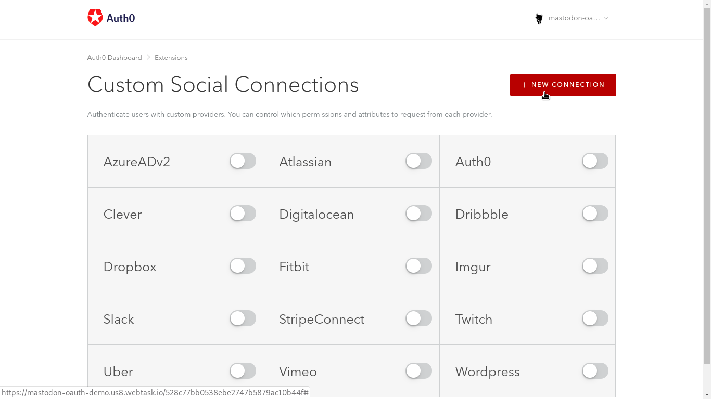
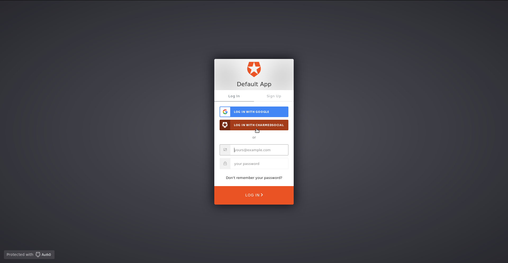

I describe in my [previous post](../how-to-add-login-with-mastodon-using-nodejs/) how to create a Node.js Express application that allows users to log in with a Mastodon instance.

That post assumes you are starting from scratch and want to manage user data yourself. For production applications, however, I like to delegate the heavy lifting on the auth side to [Auth0](https://auth0.com).

This tutorial will walk through creating an extension for Auth0 to allow social sign-on with Mastodon. If you don't have an Auth0 account, you can [sign up](https://auth0.com/signup) and try their service for free.

#### <div id='caveats'>Before you begin</div>

I'd like to reiterate the [caveats](../how-to-add-login-with-mastodon-using-nodejs#caveats) from the last post. Mastodon utilizes the OAuth 2.0 protocol for authorization, but it does not currently have a robust authentication layer like [OpenID Connect](https://openid.net/connect/) that would make it straightforward to use the same user profile across platforms. Auth0, as an identity as a service provider, cannot really shine in this integration without more help from the Mastodon side.

Let me give you an example. Normally, if I used an email address and password to log in to an application that uses Auth0, and then I logged in to the same app with a GitHub social connection, my login experience would be seamless because Auth0 would have matched my email address to my GitHub profile's email address to identify me as a single user with two login methods.

However, the user-accessible Mastodon [accounts](https://docs.joinmastodon.org/api/entities/#account) API does not include cross-platform identifiers like email. This is not a bad thing for privacy, but it does make the discussion that follows less helpful in practice.

I don't suggest you implement the following unless you only care that your users can log in with Mastodon or are able to compensate for Mastodon' technical limitations in your app. Hopefully, Mastodon will be able to integrate a more robust authentication layer in the future. Maybe developers could create an Auth0-specific API like they created for [Keybase integration](https://keybase.io/blog/keybase-proofs-for-mastodon-and-everyone)!

## Create an Auth0 Tenant

Let's dive in! Once you've created an account, log in to your Auth0 dashboard. I recommend you use a different [tenant](https://auth0.com/docs/getting-started/create-tenant) for each of your projects. If necessary, you can make one by clicking on your user icon at the top right of the page and selecting **Create tenant** in the dropdown.


Name the tenant and select your region.


You'll use the tenant URL you created in the next step.

## Create the Mastodon Application

If you haven't already, you should now head to your Mastodon instance to [create your Mastodon application](../how-to-add-login-with-mastodon-using-nodejs#create-mastodon-app). As before, keep track of your client key and client secret from that application.

Auth0 requires its own `Redirect URI` to allow the Mastodon instance to handoff login credentials. The format for this redirect is `[Your tenant URI]/login/callback`. My personal instance is [charmed.social](https://charmed.social). The redirect that Auth0 will use is at the top, followed by other, case-specific callback addresses.


## Create an Auth0 Application

Head back to your Auth0 dashboard and click **Applications** in the left navbar. You'll see a default application for your tenant, and you'll have the option to create additional applications.

Click on the **Default App** for now. If this is your first time using Auth0, I recommend you check out the **Quick Start** tab for detailed instructions on how to use Auth0 with your stack. If you follow one of the guides, your application-specific settings should be configured on the **Settings** tab here as well.

You don't have to do that now. Let's proceed with the extension and come back to how it can integrate with a local project.

## Create a Custom Social Extension

Click **Extensions** in the navbar on the lower left of the page. You'll see a number of options.


Mastodon is a social network, so we'll need to work with **Custom Social Connections**. Click on that link and install the extension to your tenant.


You'll also need to authorize Auth0 to access your Mastodon profile through the custom extension.


A number of third-party social extensions are listed here. Mastodon integration is not included out of the box, so click **New Connection** to create it.



You'll see a modal with the interface for creating a new connection.


Now to fill in the blanks. [Auth0's instructions](https://auth0.com/docs/extensions/custom-social-extensions) are fairly comprehensive, but the below is specific to Mastodon.

#### Name

This is the name that will appear on the login button. Rather than giving it your project name, give it the name of your instance. No spaces are allowed, so I prefer to use Pascal case, as in `CharmedSocial`.

#### Client ID

This is the client key from your Mastodon application. Make sure you there are no extra spaces on the ends of the input string.

#### Client Secret

The client secret from the Mastodon application. Again, watch for extra spaces.

#### Authorization URL

Once you've created an application that allows login with Mastodon, this is the endpoint your application will need to connect to for an authorization code. Mastodon instances use the endpoint `https://[instance URL]/oauth/authorize`.

My authorization URL is `https://charmed.social/oauth/authorize`.

#### Token URL

Once your application has an authorization code, it will use it to obtain an access token to the Mastodon REST API. For this endpoint, append `/oauth/token` to your instance URL.

`https://charmed.social/oauth/token`

#### Scope

This should match what you listed for `Scopes` in your Mastodon application. For login-only use, I recommend that you only read accounts information.

`read:accounts`

#### Custom Headers

This text area accepts a JSON object of headers that are required by the authorizing API. Mastodon requires a `response_type` header for its `/oauth/authorize` endpoint, as follows:

```json
{
  "response_type": "code"
}
```

#### Fetch User Profile Script

Although this text area automatically populates a function for some providers, it does not for Mastodon. I also find it a bit narrow to type in and difficult to debug. However, evidently, the `request` HTTP client is available in the background. We'll make sure of that in this script.

The JavaScript function we write will be used to get profile information from the Mastodon endpoint once previous, behind-the-scenes calls obtain an access token. If you'd like to learn more about what's going on under the hood, I implemented the functionality manually in my [previous post](../how-to-add-login-with-mastodon-using-nodejs).

This function takes an `accessToken` result from the `/oauth/token` endpoint, a context object `ctx` that we will not use, and a `cb` callback function that is provided in the environment and can be called with `error` and `profile` arguments.

Enter the following function in the text area and change out `charmed.social` in the initial `GET` request for your Mastodon instance's URL.

<!-- prettier-ignore -->
```javascript
(accessToken, ctx, cb) => {
  request.get(
    'https://charmed.social/api/v1/accounts/verify_credentials',
    {
      headers: {
        Authorization: `Bearer ${accessToken}`
      }
    },
    (err, res, body) => {
      if (err) {
        return cb(err)
      }
      if (res.statusCode !== 200) {
        return cb(`statusCode: ${res.statusCode}`)
      }
      const p = JSON.parse(body)
      const profile = {
        name: p.username,
        nickname: p.display_name,
        picture: p.avatar,
        user_id: p.id
      }
      cb(null, profile)
    }
  )
}
```

<br />

This function uses the `request` HTTP client to access Mastodon's profile endpoint with the `accessToken` in the header. It repackages the result `body` into a `profile` object and calls the `cb` with the `profile` as the second argument.

Note that the `profile` data expected should match up with Auth0's [normalized profile](https://auth0.com/docs/users/normalized/auth0) fields. Unfortunately, [Mastodon accounts](https://docs.joinmastodon.org/api/entities/#account) do not match up very well right now. As noted above, if that changes in the future (particularly if Mastodon profiles begin to include users' email addresses), logging in with Mastodon, on or off the Auth0 platform, will become a more viable option.

Click **Save**, and you'll see some new options at the bottom of the screen.

Before trying out your connection, click on the Apps tab at the top of the model and ensure the new connection is enabled for your Auth0 app.


Now head back to Settings and click on the **Try** button.


Auth0 will open a new browser tab. If all's gone well, you should see a successful result and your user profile!


Now, close this tab and return to the extension screen. If you close the modal, the connection to your Mastodon instance should appear among the **Custom Social Connections**.


You can now toggle this connection to enable it in your projects for this tenant.

## Integrate Auth0 into Your Project

If you haven't already, back in the **Applications** section of your Auth0 tenant page, follow the instructions on the **Quick Start** tab to create and set up an app on your stack that will use the new login connection.

Once that's complete, when you log in with Auth0, the new Mastodon social connection should be in place along with any other login methods you enable ([caveats](#caveats) above), and Auth0 will route normalized profile information to your project.


