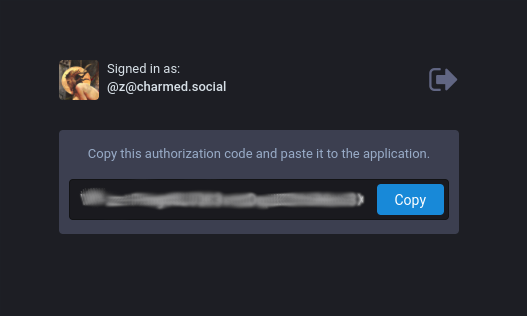

## tl;dr

There are tradeoffs to using an instance of a federated network like [Mastodon](https://joinmastodon.org) to log in to your application, but Mastodon's OAuth2 support makes it possible! If you want to try it out without following the full tutorial, you can <a href='#create-mastodon-app'>create</a> the Mastodon application, [fork](https://github.com/CharmedSatyr/mastodon-oauth-demo) the Express demo, <a href='#environment'>update</a> your environmental variables, and run `bash±npm start`.

## Introduction

[Mastodon](https://joinmastodon.org) is a free, open source, federated microblogging platform made up of thousands of communities and more than 2.2 million users. Each community, or "instance", runs independently but is connected with the whole network. A user can see a local feed of people on their instance, but they can also see a federated feed and interact with people in different instances just like people with different email providers can.

Mastodon supports the industry-standard [OAuth 2.0](https://oauth.net/2/) protocol for authorization, making it possible for developers to add a "Login with [a Mastodon instance]" button as a single sign-on option for users.

This tutorial builds on the [official documentation](https://docs.joinmastodon.org/api/authentication/) to walk through implemementing social login with Mastodon on a Node.js stack using a generated Express server and a Pug view engine.

#### <div id="caveats">Before you dive in...</div>

Unlike Facebook, Twitter, or other centralized social networking services, Mastodon is a large network of independently-operated servers. The OAuth protocol requires a peering agreement between each third-party application (your app) and authorizing server (a Mastodon instance) in the form of application-specific keys. There is no way to automate setting up peering agreements with every Mastodon instance.

In other words, setting up social login with [mastodon.social](https://mastodon.social/about/more) (the instance run by lead Mastodon developers) will not enable users of [tabletop.social](https://tabletop.social/about/more) (an instance for boardgamers and other hobbyists) to log in to your site. If you want them to, you will have to register your application on both servers.

In addition, the [accounts information](https://docs.joinmastodon.org/api/rest/accounts/) available via the REST API does _not_ include users' email addresses. That makes it tricky to use alongside unique identifiers from other platforms.

Do these quirks make social sign-on with Mastodon impractical? Not necessarily. It's perfect for applications directed toward users of a particular instance. For example:

- Educational institutions or other organizations that run Mastodon servers might want users to be able to easily log in to organization-specific apps.
- Themed apps might want to make it easy for users of similarly-themed instances to log in. For example, a website intended to help artists find clients might have a login button for [mastodon.art](https://mastodon.art/about/more) users.
- You might want to make it easy for members of a friends-and-family instance to log in to your private photo blog. Cake!

The community is considering additional ways to improve auth with Mastodon. I found some particularly helpful context in [this GitHub issue](https://github.com/tootsuite/mastodon/issues/4800).

## Prerequisites

For this tutorial, I'll assume you have a working knowledge of Node.js and JavaScript. You should be comfortable working on the command line application for your operating system. I'll also assume that you have [Node.js](https://nodejs.org/en/) and a Node.js package manager installed on your device.

#### Version information

I wrote this tutorial using the following software versions:

- Mastodon: 2.9.2
- Node.js: v12.6.0
- npm: 6.10.1
- Yeoman: 3.1.0
- Generator Express ES6: 0.6.1

Version information for packages saved to the project with **npm** can be found [here](https://github.com/CharmedSatyr/mastodon-oauth-demo/blob/master/package.json). You'll likely be able to get away with using a different but similar setup; give it a shot!

## <div id="create-mastodon-app">Create the Mastodon Application</div>

Let's get started. Your first step will be to sign in to the Mastodon instance that should authorize your users. If you don't have a Mastodon account, you can find an instance that's right for you at [instances.social](https://instances.social). This tutorial will use the instance I run, [charmed.social](https://charmed.social), for the demo.

Once you've logged in, click on **Preferences** (the cog icon above the search bar).


Next, click on **Development** in the side bar and then the **New Application** button.


Now, it's time to fill in the information for the application. I'll be using reasonable values for development, but you can change them to suit your needs.

---

#### Application Name

This is how your OAuth application will be registered on the instance server. I'm using `bash±Mastodon OAuth Demo`.

#### Application website

I'm using the localhost IP address on port 3000: `bash±http://127.0.0.1:3000`.

#### Redirect URI

You can specify multiple valid redirect URIs by putting each on a different line.

The default redirect URI is `bash±urn:ietf:wg:oauth:2.0:oob`. You should keep this here, as it will come in handy to let us know we've set everything up properly. If this callback address is specified in your local application, you will see a message on the Mastodon server when you log in rather than being redirected back to your app.

I'm going to add `bash±http://127.0.0.1:3000/callback` for use later on in development. The `bash±/callback` route will be built into our application.

#### Scopes

It's best to avoid requesting more scopes than you need for your app's functionality. Since we only want a user profile, I'm going to uncheck every top-level scope and check only `read:accounts`.

---

If you've followed along so far, your application should look something like this:


Save your values by clicking the **Submit** button at the bottom of the screen. If all goes well, you'll be redirected to the **Development** tab with your application listed and the message "Application successfully created".


#### Client variables

Now, click on the link to your application again, and you'll see that private keys have been generated for your application. At the top of the screen, you should see values for:

- Client key
- Client secret
- Your access token


Make a note of the top two, as you'll need them in your environment later.

## Create the Express Application

### Generate an Express Template

Now to set up the Express application. To speed things up a little, we'll use the scaffolding tool Yeoman with a package called Generator Express ES6. These tools produce a JavaScript server scaffolding similar to that of the official [Express application generator](https://expressjs.com/en/starter/generator.html) but include ES6 syntax and other goodies out of the box.

To install Yeoman and Generator Express ES6 on your system, type the following in your terminal:

```bash
npm i -g yo generator-express-es6
```

<br />

Once installation is complete, generate your new project with:

```bash
yo express-es6
```

<br />

Yeoman will now guide you through setup and installation. You may choose whatever options suit you, but this tutorial will keep it simple.

1. Specify whether you want to report usage statistics → your call
1. Name your project → your call; mine is `bash±mastodon-oauth-demo`
1. Create a new directory → `bash±y`
1. Select a view engine → `bash±pug`
1. Select a CSS preprocessor → `bash±none`
1. Skip adding a default test → `bash±n`
1. Install dependencies with npm → `bash±Yes, with npm`

In a few seconds, you'll have a complete Express scaffolding!

### <div id="environment">Environmental Variables</div>

Remember the client key and client secret Mastodon generated when you registered your application with the server? We'll store those in a local file your Express application can access while keeping them confidential.

We'll need to install another package to do this. Navigate into your project directory. In your terminal, type:

```bash
npm i dotenv
```

<br />

Now create a `bash±.env` file at the root of your project. Inside it, put the following, filling in the blanks with the correct values for your project.

```bash
# .env

# The `Client key` from your Mastodon app
MASTODON_CLIENT_ID=

# The `Client secret` from your Mastodon app
MASTODON_CLIENT_SECRET=

# The display name of the Mastodon instance
# E.g., Mastodon Social
MASTODON_INSTANCE_NAME=

# The URI of the Mastodon instance
# E.g., https://www.mastodon.social
MASTODON_INSTANCE_URI=

# Server redirect
MASTODON_REDIRECT_URI=urn:ietf:wg:oauth:2.0:oob

# Local redirect
# MASTODON_REDIRECT_URI=http://127.0.0.1:3000/callback

# Scopes
MASTODON_SCOPES=read:accounts
```

<br />

The values you enter should not include quotation marks or trailing slashes. Notice that the default redirect from the server is currently enabled, while the local `javascript±/callback` route is commented out.

Now, update the top of `bash±bin/start` to include the following:

```javascript
// bin/start

#!/usr/bin/env node

// highlight-range{1-5}
/**
 * Load environmental variables.
 */

require('dotenv').config();
```

<br />

This will make your environmental variables accessible throughout the application.

### Login

Add this point, we will update the project views with a login link and project-specific display titles, and then we'll add a `javascript±/login` route to our server.

Navigate to the `bash±views/` directory and open `bash±index.pug`. Modify the file to include the following:

```pug
//- views/index.pug

extends layout

block content
  h1= title
  p Welcome to #{title}
  //- highlight-range{1-4}
  if user != null
    a(href='/user') View your profile
  else
    a(href='/login') Log in with #{instance}
```

<br />

This will set up some conditional rendering: if a `bash±user` object exists, a link to the user's profile will appear. Otherwise, the user will see a login link that includes the name of the Mastodon instance they can log in with.

Now, head to the `bash±routes/` directory to make this work. In `bash±routes/index.js`, update the `javascript±title` rendered to the title you'd like to display for your project, and add an `javascript±instance` key with your environment value for `bash±MASTODON_INSTANCE_NAME` to the argument object. Pug will use these values to render appropriate views.

<!-- prettier-ignore -->
```javascript
// routes/index.js

const { Router } = require('express');

const router = Router();

/* GET index page. */
router.get('/', (req, res) => {
  res.render('index', {
    // highlight-range{1-2}
    title: 'Mastodon OAuth Demo',
    instance: process.env.MASTODON_INSTANCE_NAME
  });
});

module.exports = router;
```

<br />

Next, create an `bash±auth.js` file in the same directory. This is where we'll put the routes related to Mastodon login.

Add the following to that file:

<!-- prettier-ignore -->
```javascript
// routes/auth.js

const { Router } = require('express');

const router = Router();

/* GET login - redirects to OAuth endpoint with query string. */
router.get('/login', (req, res) => {
  const authEndpoint = `${process.env.MASTODON_INSTANCE_URI}/oauth/authorize`;

  // Set up parameters for the query string
  const options = {
    client_id: process.env.MASTODON_CLIENT_ID,
    redirect_uri: process.env.MASTODON_REDIRECT_URI,
    response_type: 'code',
    scope: process.env.MASTODON_SCOPES
  };

  // Generate the query string
  const queryString = Object.keys(options)
    .map(key => `${key}=${encodeURIComponent(options[key])}`)
    .join('&');

  // Redirect the user with app credentials to instance sign in
  const loginURI = `${authEndpoint}?${queryString}`;
  res.redirect(loginURI);
});

module.exports = router;
```

<br />

This block creates a `javascript±/login` route that redirects the user to Mastodon with the parameters for the application you set up.

To enable this router, we'll need to head back to `bash±app.js` in the project root.

First, require the `bash±auth` router at the top of the document where the other routers are imported. Then, have the app `bash±use` your router. I tend to put auth routers before the others.

```javascript
// app.js

// Some generated `require` statements...

const authRouter = require('./routes/auth'); // highlight-line
const indexRouter = require('./routes/index');

// Additional setup and middleware...

app.use(authRouter); // highlight-line
app.use('/', indexRouter);

// The rest of the file...
```

<br />

This is a good time to test that our application works so far.

Make sure your changes are saved, and start the server in your terminal:

```bash
npm start
```

<br />

You should see `bash±node` start and log to your terminal. Now, in your browser, navigate to `bash±http://127.0.0.1:3000`.

You should see a simple home page with your project title, a welcome message, and a link to log in using your Mastodon instance.


Now for the moment of truth: try the login link. You should be directed to a Mastodon login page. Once you sign in, you should see an authorization code on the default redirect page. The code will be different every time you login.



If you've gotten this far, well done! You have set up a peering agreement between a Mastodon instance and a local Express application. You are able to connect to that instance and have received an authorization code that allows you to request access to the Mastodon REST API.

In our next step, we will implement a custom callback so the Express server will automatically use the authorization code it receives to access the Mastodon server's REST API and get the user's profile.

### Callback

Let's head back to the `bash±.env` file. With a `bash±#` symbol, comment out the `bash±MASTODON_REDIRECT_URI` value we were using and uncomment the one that uses the localhost URI you registered in the Mastodon application. The next time we try to log in, instead of redirecting us to a page with the authorization code, Mastodon will redirect us to the callback address.

```bash
# .env

# Other values above...

# Server redirect
# highlight-range{1}
# MASTODON_REDIRECT_URI=urn:ietf:wg:oauth:2.0:oob

# Local redirect
# highlight-range{1}
MASTODON_REDIRECT_URI=http://127.0.0.1:3000/callback

# Other values below...
```

<br />

Now we need to create a callback route in `bash±routes/auth.js` and implement a function to get the user profile.

At the top of `bash±routes/auth.js`, require the `bash±authorize` method from `bash±./oauth/mastodon.js` at the top of the file, and add a `javascript±/callback` route below the `javascript±/login` route.

<!-- prettier-ignore -->
```javascript
// routes/auth.js

const { Router } = require('express');

const { authorize } = require('./oauth/mastodon'); // highlight-line

const router = Router();

// Login route...

//highlight-range{1-11}
/* GET OAuth callback */
router.get('/callback', (req, res) => {
  authorize(req)
    .then((user) => {
      res.json(user);
    })
    .catch((err) => {
      console.error(err);
      res.redirect('/');
    });
});

module.exports = router;
```

<br />

This code calls an `authorize` function that returns a Promise when the `javascript±/callback` route is hit. In this implementation, the Promise will either resolve to a `user` object and display that object in the browser in JSON format, or it will reject with an error and redirect to the application's home page. In a later step, we will add some additional code to incorporate the `user` object into our views.

Currently, we are requiring `authorize` from a nonexistent file. Let's fix that. First, create a folder called `oauth` in `routes/`. If you refactor this project later to include other OAuth providers (Twitter, GitHub, etc.), it will be nicer to have the different implementations in their own folder.

Create a `bash±mastodon.js` file inside `bash±oauth/`. The `bash±authorize` function will need to interact with Mastodon's REST API with `POST` and `GET` requests. We can make those easier by installing an HTTP client. This tutorial will use `superagent`, but you use vanilla AJAX or your preferred client. ([Click here](https://gist.github.com/CharmedSatyr/3f45fe7a10cec5f50f68ab425d0053f4) to see an implementation that uses `request`—I wrote it to return a Promise, so it can be simply dropped in as `bash±routes/oauth/mastodon.js` in place of the below.)

To install `bash±superagent`, enter the following on the command line:

```bash
npm i superagent
```

<br />

Then, paste the below into `bash±routes/oauth/mastodon.js`.

<!-- prettier-ignore -->
```javascript
// routes/oauth/mastodon.js

const superagent = require('superagent');

const authorize = (req) => {
  // The authorization code returned from Mastodon on a successful login
  const { code } = req.query;
  console.log('(1) AUTHORIZATION CODE:', code);

  // Token endpoint
  const tokenURI = `${process.env.MASTODON_INSTANCE_URI}/oauth/token`;

  // Profile endpoint
  const profileURI = `${process.env.MASTODON_INSTANCE_URI}/api/v1/accounts/verify_credentials`;

  // Parameters to send for a token
  const params = {
    client_id: process.env.MASTODON_CLIENT_ID,
    client_secret: process.env.MASTODON_CLIENT_SECRET,
    code,
    grant_type: 'authorization_code',
    redirect_uri: process.env.MASTODON_REDIRECT_URI,
    scopes: 'read:accounts'
  };

  // Post the `params` as form data to the `tokenURI` endpoint
  // to retrieve an access token.
  // `superagent` returns a Promise by default.
  return superagent
    .post(tokenURI)
    .type('form')
    .send(params)
    .then((tokenResponse) => {
      // Access the token in the response body
      const token = tokenResponse.body.access_token;
      console.log('(2) ACCESS TOKEN:', token);

      // Use the token to GET the user's profile
      return superagent
        .get(profileURI)
        .set('Authorization', `Bearer ${token}`)
        .then((profileResponse) => {
          // The response body contains the profile information needed
          // for the app. Log `p` to see all the data included.
          const p = profileResponse.body;

          // Normalize the profile.
          const profile = {
            created_at: p.created_at,
            picture: p.avatar,
            nickname: p.display_name,
            user_id: p.id,
            username: p.username
          };
          console.log('(3) USER PROFILE:', profile);

          return profile;
        })
        .catch(err => err);
    });
};

module.exports = { authorize };
```

<br />

The `authorize` function does the following:

1. Given the request object from the `javascript±/callback` route, it accesses the authorization code received from the Mastodon server.

1. It posts that code with other required application parameters to the token endpoint.

1. With the token it gets back, it makes another request to get the profile information for the logged-in user from the profile endpoint.

This is another good time to test our progress. Restart the server and try to log in. This time, you should be redirected back to your local Express application instead of the Mastodon page from before, and your profile information should be displayed in JSON format. (My browser formats JSON responses.)


In addition, the `authorize` function should log each step to the terminal application where the server is running. Next, we will make this user data persistent and display it with our Pug view engine.

### Sessions

The HTTP protocol is stateless, which means that the information we receive from the Mastodon server won't automatically persist through a browser refresh, be saved across routes, or be visible to the view engine without a local store. Let's set up session middleware to provide one.

Enter the following in your terminal to install the `express-session` middleware:

```bash
npm i express-session
```

<br />

Now, update `app.js` by requiring `express-session` at the top and initializing it just before the routers.

<!-- prettier-ignore -->
```javascript
// app.js

const cookieParser = require('cookie-parser');
const express = require('express');
const session = require('express-session'); // highlight-line
const httpErrors = require('http-errors');
const logger = require('morgan');
const path = require('path');

// More code...

app.use(express.static(path.join(__dirname, 'public')));

// highlight-range{1-10}
const sess = {
  secret: 'nutella-wonton', // Choose your own secret!
  cookie: {
    secure: app.get('env') === 'production'
  },
  resave: false,
  saveUninitialized: false
};

app.use(session(sess));

app.use(authRouter);
app.use('/', indexRouter);

// The rest of the file...

````

<br />

Now, we can store information across routes in a `session` object appended to our requests. You can read more about configuring Express sessions [here](https://npmjs.com/package/express-session).

### User Profile

Now that we're able to retain user information, let's create a Pug view to display the user profile!

In `views/`, create a new file named `user.pug`. Inside, we'll extend the default layout and render a display based on whether the server has received a `user` object.

```pug
//- views/user.pug

extends layout

block content
  h1= title
  if user != null
    h2 Hi there, #{user.nickname}!
    h3 Your profile
    pre=JSON.stringify(user, null, 2)
    a(href='/logout') Log out
  else
    p Hi there, anonymous!
    a(href='/login') Log in with #{instance}
```

<br />

If the user is logged in, they will see their nickname (display name) from Mastodon, a JSON output of their user profile, and a logout button we'll work on later. If they navigate to `javascript±/user` without being logged in, they will be presented with a generic greeting with a login button.

Now, let's update our routes to render this page.

First, we should update the `javascript±/callback` route to append the Mastodon `user` object to the `javascript±session` object on the request and redirect us to the `javascript±/user` page.

<!-- prettier-ignore -->
```javascript
// routes/auth.js

// Setup and login code...

/* GET OAuth callback */
router.get('/callback', (req, res) => {
  authorize(req)
    .then((user) => {
      // highlight-range{1,2}
      req.session.user = user;
      res.redirect('/user');
    })
    .catch((err) => {
      console.error(err);
      res.redirect('/');
    });
});

module.exports = router;
```

<br />

Now that we have user information to work with, create a new file in the `bash±routes/` folder named `bash±user.js`. The `javascript±/user` route should look like this:

<!-- prettier-ignore -->
```javascript
// routes/user.js

const { Router } = require('express');

const router = Router();

/* GET user profile. */
router.get('/user', (req, res) => {
  res.render('user', {
    instance: process.env.MASTODON_INSTANCE_NAME,
    title: 'User Profile',
    user: req.session.user
  });
});

module.exports = router;
```

<br />

The handler will now render a `user` view and pass our Mastodon instance name, application title, and `user` object to the view layer!

Let's enable this route in `app.js`!

```javascript
// app.js

// Some generated `require` statements...

const authRouter = require('./routes/auth');
const indexRouter = require('./routes/index');
const userRouter = require('./routes/user'); // highlight-line

// Additional setup and middleware...

app.use(authRouter);
app.use('/', indexRouter);
app.use(userRouter); // highlight-line

// The rest of the file...
```

<br />

Time for another test! Make sure to restart your server and return to the home page at `bash±http://127.0.0.1:3000`. Click on the login link, sign into your Mastodon account, and you should be redirected to your User Profile page that displays a JSON object of your Mastodon profile information.


Your Express application is now able to connect to the application you created on the Mastodon server and use local credentials to get an authorization code. It uses the code to request authorization to access the REST API. When it receives a Bearer token, it requests your user profile. The user profile is parsed and stored in a local session, allowing it to be displayed in the application's views.

We're almost finished. The last step is implementing a `javascript±/logout` route.

## Logout

Let's make a couple of changes to our setup to ensure a user's session is terminated both on the Mastodon instance and in our local application on logout. First, in `bash±routes/auth.js`, require a `bash±revoke` method from the same file as `bash±authorize`. Then, add one more route at the bottom, `javascript±/logout`.

<!-- prettier-ignore -->
```javascript
// routes/auth.js

const { Router } = require('express');

const { authorize, revoke } = require('./oauth/mastodon'); // highlight-line

// More code, including login and callback routes...

// highlight-range{1-13}
/* GET logout - destroys local session and revokes API token. */
router.get('/logout', (req, res) => {
  revoke(req)
    .then((response) => {
      req.session.destroy((err) => {
        if (err) {
          console.log(err);
        }
        res.redirect('/');
      });
    })
    .catch(console.error);
});

module.exports = router;
```

<br />

This handler calls a `bash±revoke` function we'll soon implement in `routes/oauth/mastodon.js` and expects it to return a Promise. If `bash±revoke` is successful (invalidating the access token from the Mastodon instance), it will call the `javascript±session.destroy()` method to remove the user data from the local session.

Now to write the `bash±revoke` function. As above, I'm implementing this function with the `bash±superagent` HTTP client, but the `bash±request` version can be found [here](https://gist.github.com/CharmedSatyr/3f45fe7a10cec5f50f68ab425d0053f4).

<!-- prettier-ignore -->
```javascript
// routes/oauth/mastodon.js

// Require `superagent`...

// Define `authorize` function...

// highlight-range{1-13}
const revoke = (req) => {
  const params = {
    client_id: process.env.MASTODON_CLIENT_ID,
    client_secret: process.env.MASTODON_CLIENT_SECRET
  };
  const logoutURI = `${process.env.MASTODON_INSTANCE_URI}/oauth/revoke`;
  return superagent
    .post(logoutURI)
    .type('form')
    .send(params)
    .then(response => response)
    .catch(err => err);
};

module.exports = { authorize, revoke }; // highlight-line
```

<br />

That's it! Let's test the login/logout functionality to be sure everything's in order.

Restart the server, make sure everything's in order on the home page, and click the login link. You should be presented with your user profile.

Don't click the logout button yet! Instead, manually type in the address for your home page again, then manually re-enter `bash±http://127.0.0.1:3000/user`. Your profile should still be there!

This time, click logout at the bottom. You'll be redirected to the home page. If you manually visit `bash±http://127.0.0.1:3000/user`, the server should consider you anonymous because your user session was destroyed.

## Summary

And there we have it! You now have an Express server with a Pug view engine. It will allow you to view a home page, log in with Mastodon social sign-on, see information from your Mastodon profile on a user profile page, and log out.

Although the Mastodon profiles lack unique identifiers that can be used across Mastodon instances or other services (e.g., no email), on top of other challenges OAuth with Mastodon faces, it also might be perfect for your use case.
